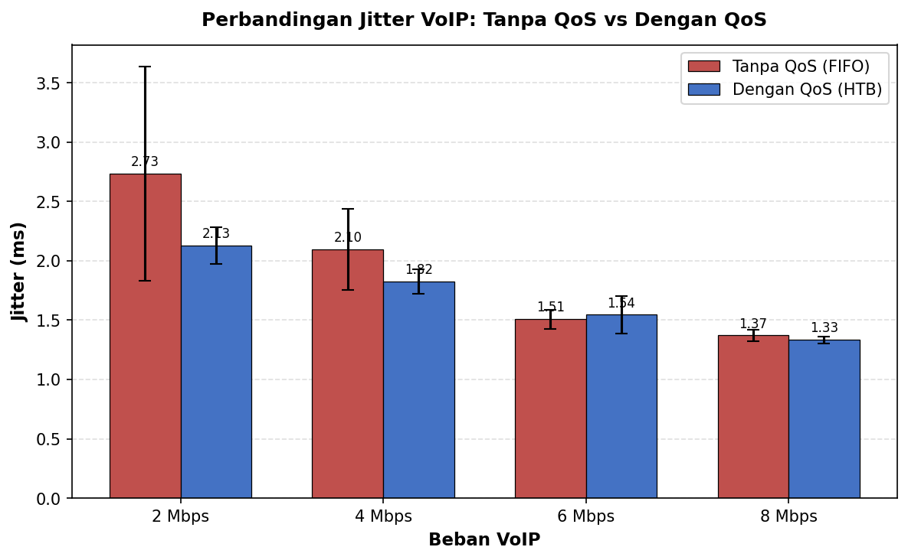
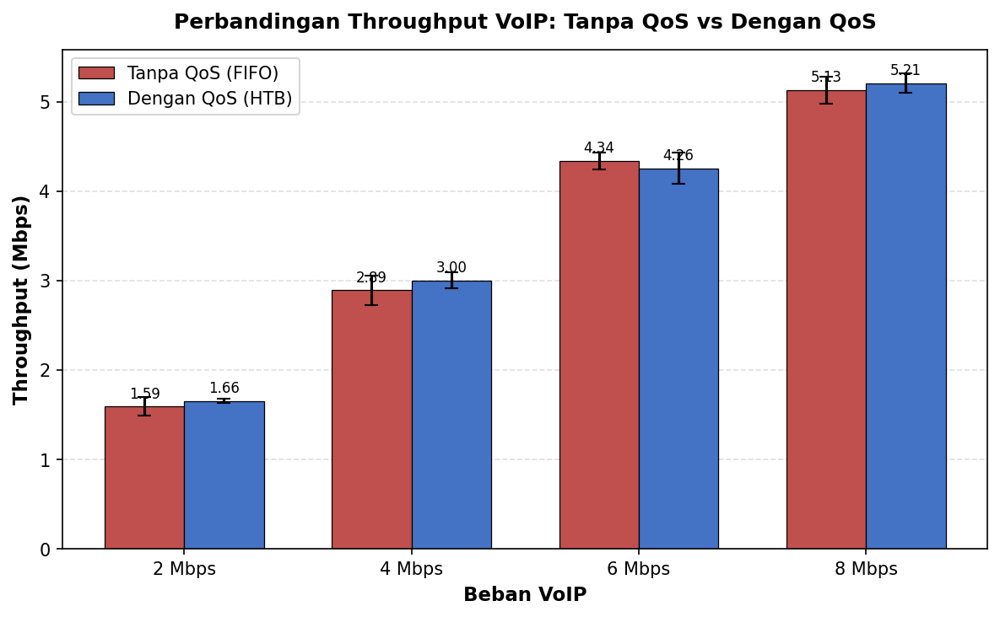
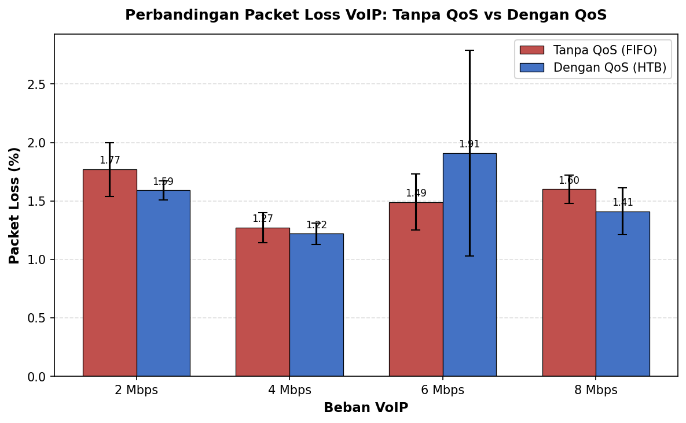
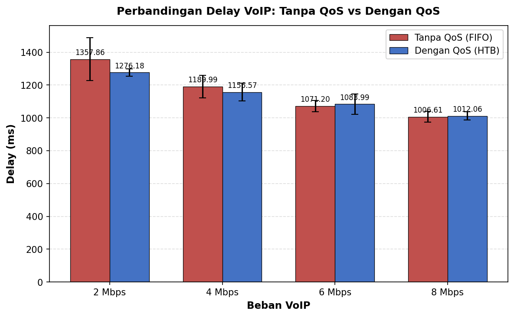

# QoS Management for Real-Time Traffic on SDN
> **Implementasi Manajemen Quality of Service (QoS) untuk Trafik Real-Time pada Jaringan Software Defined Networking**
> 
> Tugas Akhir — Teknik Telekomunikasi, Institut Teknologi Sepuluh Nopember (ITS) Surabaya


---

## 📌 Overview

This project implements **Quality of Service (QoS)** management on a **Software Defined Networking (SDN)** environment to guarantee real-time traffic quality, specifically **VoIP (Voice over IP)**.

The network is emulated using **Mininet** with **Ryu Controller** as the centralized SDN controller. **Hierarchical Token Bucket (HTB)** is configured on **Open vSwitch** to enforce bandwidth guarantees and traffic prioritization. End-to-end performance is measured using **D-ITG** across four VoIP load levels.

**Key finding:** HTB-based QoS reduces jitter by up to **22.1%** and improves packet loss by up to **10.2%** for VoIP traffic under congestion, with the most significant improvement at low-to-medium loads where VoIP demand stays within the guaranteed bandwidth threshold.

---

## 🛠️ Tech Stack

| Component | Tool / Version |
|---|---|
| Network Emulator | Mininet 2.3 |
| SDN Controller | Ryu Controller 4.x (Python) |
| Virtual Switch | Open vSwitch 2.x |
| QoS Mechanism | HTB (Hierarchical Token Bucket) |
| SDN Protocol | OpenFlow 1.3 |
| Traffic Generator | D-ITG (Distributed Internet Traffic Generator) |
| OS / VM | Ubuntu 24.04 LTS on VirtualBox |
| Language | Python 3, Bash |

---

## 🗺️ Network Topology

```
                    ┌─────────────────────────────┐
                    │      Ryu Controller          │
                    │   (OpenFlow 1.3, port 6653)  │
                    └──────────┬──────────────────┘
                               │ control plane
          ┌────────────────────┼────────────────────┐
          │                                         │
   ┌──────┴──────┐                          ┌───────┴─────┐
   │  Access SW  │◄── 10 Mbps bottleneck ──►│  Access SW  │
   │     s2      │      (HTB Queue)          │     s3      │
   └─────────────┘                          └─────────────┘
    │     │     │                            │     │     │
   h1    h2    h3                           h4    h5    h6
(VoIP) (BG)  (BG)                        (recv)

HTB Configuration on bottleneck link (s1):
├── Queue 0 — VoIP  : min-rate 7 Mbps, priority 100 (HIGH)
└── Queue 1 — Background : min-rate 1 Mbps, priority 10  (LOW)
```

---

## ⚙️ How It Works

### 1. Traffic Classification (Ryu Controller)
The Ryu Controller inspects every packet-in event and classifies traffic by protocol:

```python
REALTIME_UDP_PORTS = {5001, 5003}   # VoIP ports

if ip and udp_pkt:
    if udp_pkt.dst_port in REALTIME_UDP_PORTS:
        queue_id = QUEUE_REALTIME    # → Queue 0 (high priority)
    else:
        queue_id = QUEUE_BACKGROUND  # → Queue 1 (low priority)

actions = [OFPActionSetQueue(queue_id), OFPActionOutput(out_port)]
```

### 2. HTB Queue Enforcement (Open vSwitch)
HTB is applied to both bottleneck ports via OVSDB:

```bash
ovs-vsctl set port s1-eth1 qos=@newqos -- \
    --id=@newqos create qos type=linux-htb \
        other-config:max-rate=10000000 \
        queues:0=@q0 queues:1=@q1 -- \
    --id=@q0 create queue \
        other-config:min-rate=7000000 \
        other-config:max-rate=10000000 \
        other-config:priority=100 -- \
    --id=@q1 create queue \
        other-config:min-rate=1000000 \
        other-config:max-rate=10000000 \
        other-config:priority=10
```

---

## 📊 Results
### Comparison Charts






Testing was conducted with N=5 repetitions per scenario, 60 seconds each. VoIP traffic generated via D-ITG (UDP), background traffic via iperf3 (TCP greedy).

### Baseline (No Background Traffic)

| Metric | Value |
|---|---|
| Delay | 9.40 ms |
| Jitter | 0.969 ms |
| Packet Loss | 0.00% |
| Throughput | 1.728 Mbps |

### VoIP Load Variation — QoS OFF vs ON

| Load | Delay OFF (ms) | Delay ON (ms) | Jitter OFF (ms) | Jitter ON (ms) | Loss OFF (%) | Loss ON (%) | Throughput OFF (Mbps) | Throughput ON (Mbps) |
|:---:|:---:|:---:|:---:|:---:|:---:|:---:|:---:|:---:|
| 2 Mbps | 1357.86 | 1276.18 | 2.734 ± 0.905 | 2.130 ± 0.155 | 1.77 | 1.59 | 1.590 | 1.655 |
| 4 Mbps | 1189.99 | 1156.57 | 2.097 ± 0.341 | 1.824 ± 0.102 | 1.27 | 1.22 | 2.891 | 3.001 |
| 6 Mbps | 1071.20 | 1083.99 | 1.508 ± 0.081 | 1.545 ± 0.160 | 1.49 | 1.91* | 4.340 | 4.256 |
| 8 Mbps | 1006.61 | 1012.06 | 1.371 ± 0.050 | 1.334 ± 0.028 | 1.60 | 1.41 | 5.131 | 5.209 |

> *6 Mbps QoS-ON packet loss inflated by one outlier run (run-5: 3.45%); excluding outlier gives ~1.52%, consistent with QoS-OFF.

### Key Findings

| Finding | Detail |
|---|---|
| **Jitter reduction** | Up to **−22.1%** at 2 Mbps load |
| **Jitter consistency** | SD collapsed **0.905 → 0.155 ms (−83%)** at 2 Mbps — most significant stabilization effect |
| **Packet loss reduction** | Up to **−10.2%** at 2 Mbps load |
| **Throughput** | Consistent improvement across all loads; QoS-ON always ≥ QoS-OFF |
| **Transition point** | QoS effectiveness diminishes at 6 Mbps (approaching 7 Mbps guarantee threshold) |
| **Overload behavior** | At 8 Mbps (> 7 Mbps guarantee), QoS still provides partial protection (−11.9% loss) |
| **Delay / Bufferbloat** | High delay (1000–1358 ms) is a bufferbloat artifact from greedy TCP; HTB (a scheduler) does not resolve this — AQM (e.g. CoDel) would be needed |

### TIPHON / ITU-T G.114 Evaluation

| Scenario | Delay (ITU-T) | Jitter (TIPHON) | Packet Loss (TIPHON) | Throughput (TIPHON) |
|---|---|---|---|---|
| Baseline | ✅ Sangat Baik | ✅ Baik | ✅ Sangat Baik | ✅ Baik |
| 2–8 Mbps (all) | ⚠️ Buruk (bufferbloat) | ✅ Baik | ✅ Baik | ✅ Baik–Sangat Baik |

---

## 📁 File Structure

```
📦 qos-sdn-voip
 ┣ 📜 topo.py               # Mininet Tree 2-Level topology (3 switches, 6 hosts)
 ┣ 📜 ryu_controller.py     # SDN controller — traffic classification + HTB queue assignment
 ┣ 📜 setup_qos.sh          # HTB queue configuration via OVSDB
 ┣ 📜 run_test.sh           # Automated D-ITG test runner (all load scenarios)
 ┣ 📜 analyze.py            # Parse D-ITG logs → compute mean, SD, graphs
 ┣ 📂 results/              # Raw D-ITG output logs per run
 ┣ 📂 figures/              # Generated comparison charts (jitter, loss, throughput, delay)
 ┗ 📜 README.md
```

---

## 🚀 Quick Start

### Prerequisites
```bash
# Mininet
sudo apt-get install mininet

# Ryu Controller
pip install ryu

# Open vSwitch
sudo apt-get install openvswitch-switch

# D-ITG (build from source)
# https://traffic.comics.unina.it/software/ITG/
```

### Running the Simulation

```bash
# 1. Start Ryu Controller (separate terminal)
cd ~/sdn_qos
ryu-manager ryu_controller.py --observe-links

# 2. Start Mininet topology (separate terminal)
sudo mn --custom topo.py --topo qostopo \
    --controller remote,ip=127.0.0.1,port=6653 \
    --switch ovsk,protocols=OpenFlow13

# 3. Apply HTB QoS configuration
sudo bash setup_qos.sh

# 4. Verify connectivity
mininet> pingall   # expected: 0% dropped (30/30)

# 5. Run test scenario (example: 4 Mbps VoIP load)
bash run_test.sh 4   # runs 5 repetitions x 60s each

# 6. Analyze results
python3 analyze.py results/
```

---

## 📚 References

- ITU-T G.107 — E-Model for voice quality estimation
- ITU-T G.114 — One-way delay requirements for VoIP
- ETSI TIPHON TR 101 329 — QoS classification standards
- Ali et al. (2024) — QoS and Congestion Control in SDN using Policy-Based Routing
- Hamad et al. (2023) — QoS Assessment in SDN using Meter Table and Floodlight

---

## 👤 Author

**Muhammad Fithriyanto**  
Telecommunications Engineering — Network and Telecommunications Media  
Institut Teknologi Sepuluh Nopember (ITS) Surabaya  
📧 ryanto.muhammad04@gmail.com  
🔗 [LinkedIn] www.linkedin.com/in/muhammad-fithriyanto-92a7a924a
